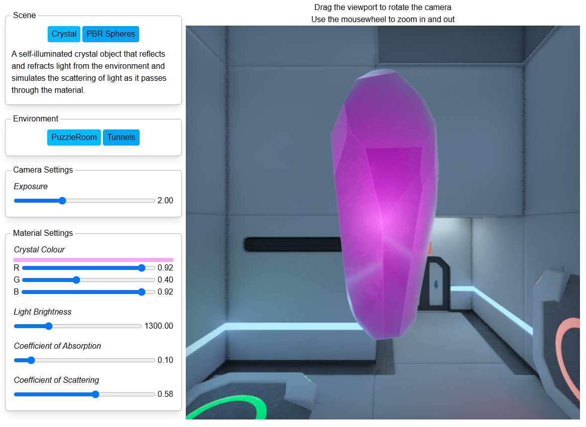
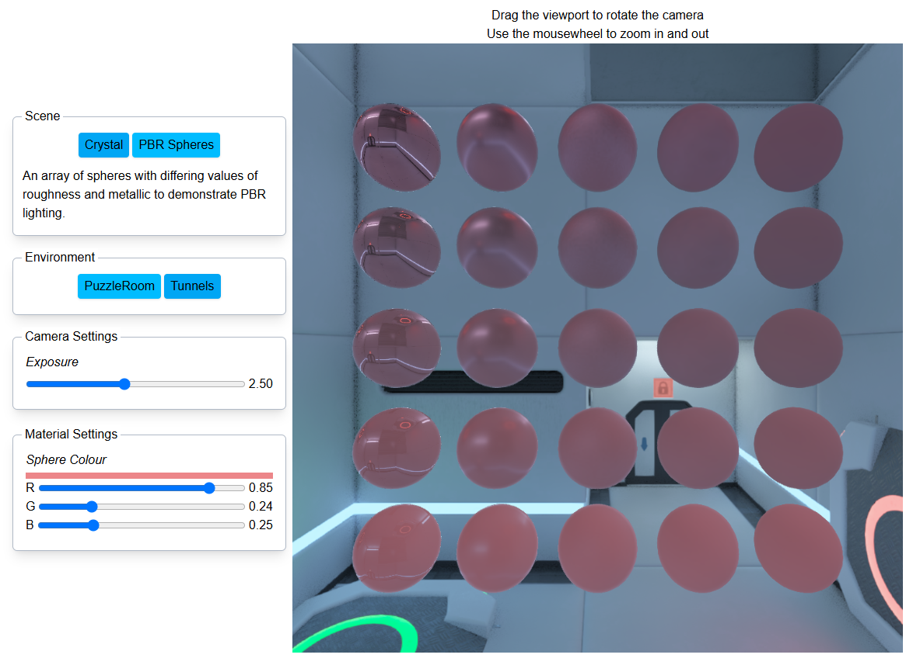
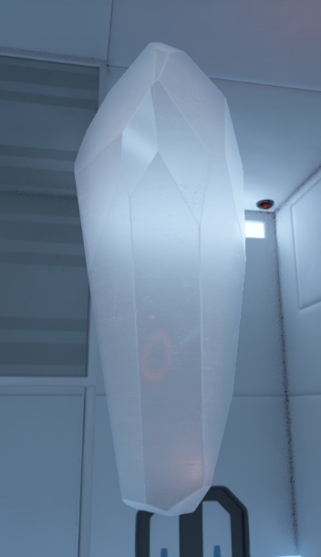

# WebGL Scattering Demo

A light-scattering effect originally created for the indie game [Whitematter](https://whitematter.xyz) using Unreal Engine materials and HLSL, and ported to WebGL as a demonstration of the shader code and rendering code.



The UI and core framework stack use:
- [Next.js](https://nextjs.org)
- [React](https://react.dev)
- [TailwindCSS](https://tailwindcss.com/)

The following libraries are used to support the rendering logic:
- [glMatrix](https://glmatrix.net/) - linear math library
- [parse-exr](https://github.com/dmnsgn/parse-exr) - parsing HDR .exr files

Otherwise, all rendering occurs on a canvas using a WebGL 2.0 context. A custom-built light abstraction layer over WebGL is used to assist with common rendering tasks. Some of the GLSL shaders use third-party code, namely the FXAA and PBR implementations - these shader files have been annotated with their source accordingly. Otherwise all GLSL shaders are hand-crafted.

All environment maps have been rendered out from [Whitematter](https://whitematter.xyz) using Unreal Engine's renderer. The crystal model is sourced from the game's assets also.

In addition to the demonstrated scattering effect and rendering abstraction layer, the demo code contains implementation for the following features:
- Multiple-viewpoint scene rendering
- Material instance system for easy control over shader parameters
- PBR (physically based rendering) for scene objects using image-based lighting (IBL) from the environment map
- HDR (high-dynamic range) rendering pipeline with exposure-based tonemapper
- Per-viewpoint post-processes, including FXAA and vignette



### Scattering

The scattering effect is implemented using two passes.

The first pass is a simple depth-only pass which draws the scene with the face culling flipped, e.g. only the back-face geometry is drawn to the depth buffer.

The second pass combines surface lighting and transmission lighting to determine the final fragment colour. The distance between the current fragment and that sampled from the depth buffer rendered in the first pass establishes the "thickness" of the object, e.g. how far light along the view ray would need to travel through the object.

The algorithm simulates a single point-light that emits light which is transmitted through the object (in the real game, other types of light are also supported, e.g. texture-based lights used for the digiprints). Transmission lighting is calculated by ray-marching through the object and calculating how much light is absorbed by the material as it travels from the light source to the sample point (Beer's law), how much light is scattered toward the view ray (Schlick scattering), how much of the remaining light is absorbed as it travels to the surface point, and finally scattered again by the surface roughness.

Once the ray reaches the exit surface point, an additional calculation simulates how light from the background travels along the ray, providing a degree of translucency. The same cubemap used by the IBL lighting system for reflections is used to provide this refraction colour also.

By turning off the light source and reducing the coefficients of absorption and scattering to low values, it's possible to see light from the environment scattering through the material.



The shader code can be found at [public/shaders/scatter-volume.glsl](https://github.com/thomasfn/webgl-scattering-demo/blob/master/public/shaders/scatter-volume.glsl). It's more or less a direct port of the HLSL code used in the actual game, though the translucency term was excluded from the game due to complications sampling the background when composited in the real scene (coupled with a generally low contribution that translucency made to the overall image with the chosen art direction).

## Building

Building the project can be done on both Windows (via WSL) and Linux using the provided Docker container.

```bash
docker compose up -d
```

Open [http://localhost:3000](http://localhost:3000) with your browser to view the app.
